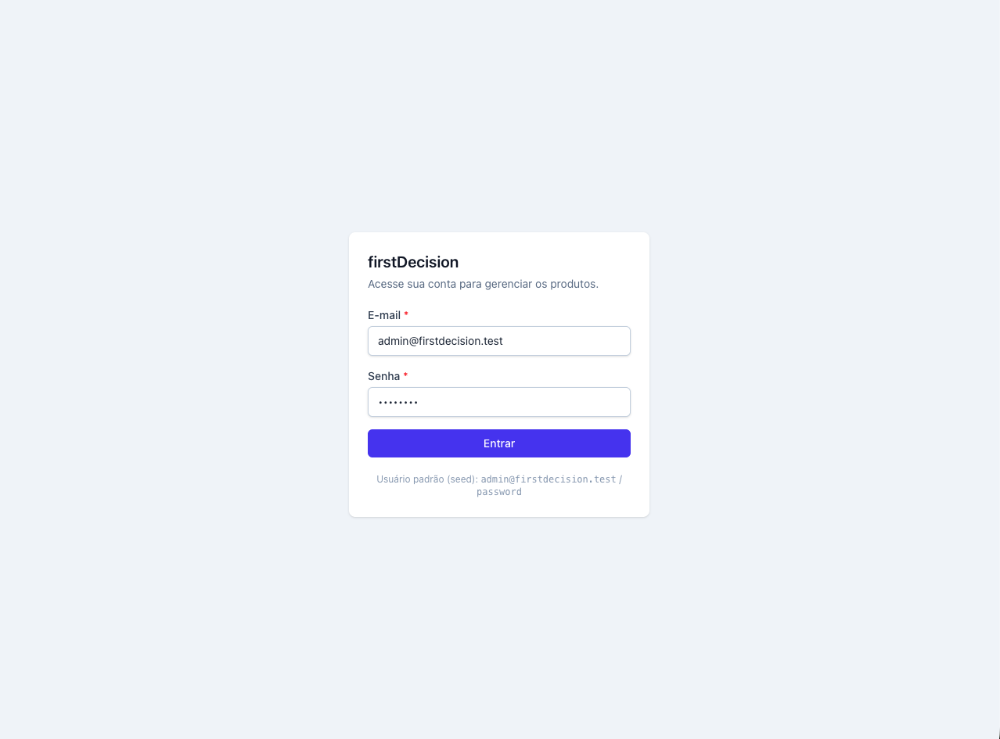
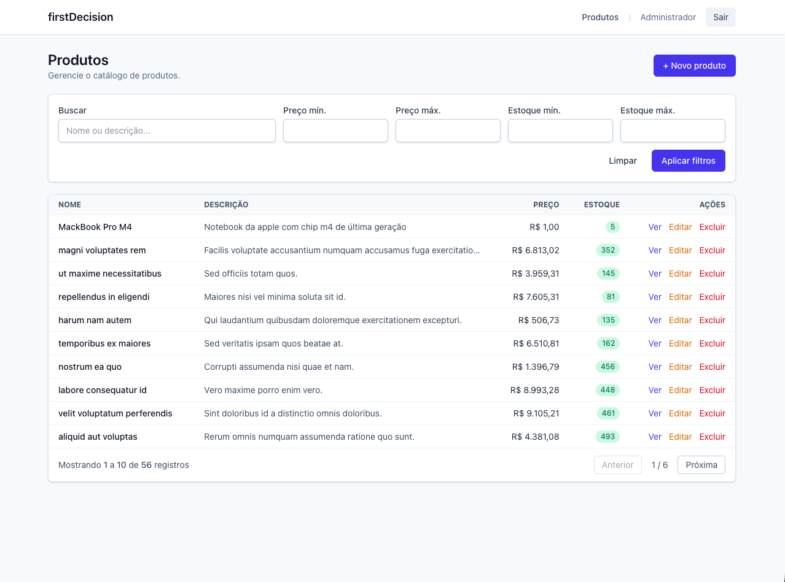

# firstDecision — Gerenciamento de Produtos

Aplicação fullstack desenvolvida como teste técnico para a vaga de **Desenvolvedor PHP (Laravel) / Vue**. Implementa um CRUD completo de produtos com:

- **Backend:** Laravel 13 (PHP 8.4) + Sanctum + arquitetura em camadas (Controller → Service → Repository)
- **Frontend:** Vue 3 (SPA dentro do mesmo projeto Laravel) + Vue Router 5 + Pinia + Tailwind CSS 4
- **Infra:** Docker Compose (PHP-FPM, Nginx, MySQL 8, Node)
- **Qualidade:** PHPUnit 12 (unit + feature), Form Requests, API Resources, exception handler global, princípios SOLID
- **Documentação:** OpenAPI 3 / Swagger UI gerado via `darkaonline/l5-swagger` — annotations isoladas em `app/OpenApi/` (controllers permanecem 100% limpos)

---

## Telas

### Login

Tela de autenticação com validação client-side, mensagens de erro e dica das credenciais do seed para facilitar o teste.



### Listagem de produtos

Listagem com paginação, busca por nome/descrição, filtros por faixa de preço e estoque, indicador visual de estoque (vermelho quando zerado, verde caso contrário) e ações inline (Ver / Editar / Excluir).



---

## Estrutura

```
firstDecision/
├── backend/                # Aplicação Laravel + Vue (SPA em resources/js)
│   ├── app/
│   │   ├── Http/
│   │   │   ├── Controllers/Api/    # AuthController, ProductController
│   │   │   ├── Filters/            # ProductFilters (search, price, stock, sort)
│   │   │   ├── Requests/           # Form Requests (validação)
│   │   │   └── Resources/          # API Resources
│   │   ├── Models/                 # User, Product
│   │   ├── Repositories/           # Contract + Eloquent (DIP)
│   │   ├── Services/               # ProductService (regras de negócio)
│   │   ├── Traits/ApiResponse.php  # Padronização { data, message, errors }
│   │   └── OpenApi/                # Spec OpenAPI 3 (Schemas, Paths, Responses) — totalmente isolada dos controllers
│   ├── resources/
│   │   ├── js/                     # SPA Vue (router, stores, pages, components)
│   │   └── views/app.blade.php     # Shell da SPA
│   ├── routes/
│   │   ├── api.php                 # Endpoints REST (auth + products)
│   │   └── web.php                 # Catch-all servindo a SPA
│   └── tests/                      # PHPUnit (Unit + Feature)
├── docker/
│   ├── nginx/default.conf
│   └── php/Dockerfile
├── docker-compose.yml
├── .env.example                    # Variáveis do compose (UID/GID/portas/DB)
└── README.md
```

---

## Pré-requisitos

- Docker + Docker Compose
- (Opcional, para desenvolvimento sem Docker) PHP 8.3+, Composer 2, Node 20+

---

## Como executar (Docker)

```bash
# 1. Clonar o repositório
git clone <url-do-repo>
cd firstDecision

# 2. Copiar variáveis de ambiente
cp .env.example .env                       # variáveis do compose
cp backend/.env.example backend/.env       # variáveis do Laravel

# 3. Subir os contêineres
docker-compose up -d --build

# 4. Instalar dependências PHP e gerar APP_KEY
docker-compose exec app composer install
docker-compose exec app php artisan key:generate

# 5. Rodar migrations e seeders
docker-compose exec app php artisan migrate --seed

# 6. (Opcional) Build de produção do frontend
docker-compose exec node npm run build
```

A aplicação ficará disponível em:

- **Web (SPA):** http://localhost:8000
- **API:** http://localhost:8000/api
- **Documentação Swagger UI:** http://localhost:8000/api/documentation
- **OpenAPI JSON:** http://localhost:8000/docs
- **Vite (dev server):** http://localhost:5173 (HMR; usado automaticamente quando `php artisan serve` está em modo dev)
- **MySQL:** localhost:3306

### Credenciais padrão (UserSeeder)

| E-mail                          | Senha     |
| ------------------------------- | --------- |
| `admin@firstdecision.test`      | `password`|

---

## Como executar os testes

```bash
docker-compose exec app php artisan test
# ou:
docker-compose exec app vendor/bin/phpunit
```

A suíte usa SQLite em memória (definido em `phpunit.xml`).

Resultado atual:

```
Tests:  29, Assertions: 109, Duration: ~250ms
```

---

## Postman / Insomnia

Coleção pronta em [postman/](postman/), com fluxo automatizado:

- `postman/firstDecision.postman_collection.json` — todos os endpoints organizados em **Auth** e **Products**
- `postman/firstDecision.local.postman_environment.json` — environment com `base_url`, `token` e `product_id`

**Como usar:**

1. No Postman: `Import` → arraste os dois arquivos.
2. Selecione o environment `firstDecision (Local)` no canto superior direito.
3. Rode `Auth › Login` (credenciais do seed já preenchidas) — o **token Sanctum** é capturado automaticamente via test script e gravado em `{{token}}`.
4. As demais requests já usam `Bearer {{token}}` por herança da coleção. Em `Create`, o `id` retornado é salvo em `{{product_id}}` automaticamente, encadeando os próximos requests.

A coleção segue o schema **Postman v2.1** (compatível com Insomnia, Bruno e Hoppscotch via import).

---

## Documentação interativa (Swagger UI)

A API é documentada via OpenAPI 3, com as annotations 100% **separadas** dos controllers — ficam em `app/OpenApi/`:

```
app/OpenApi/
├── OpenApiSpec.php          # @OA\Info, @OA\Server, @OA\SecurityScheme (Sanctum)
├── Schemas/                 # Product, User, ApiSuccess, ApiError, PaginationMeta
├── RequestBodies/           # LoginRequest, RegisterRequest, StoreProductRequest, UpdateProductRequest
├── Responses/               # ProductResource, ProductCollection, AuthSession (compostas via allOf)
└── Paths/                   # AuthPaths, ProductPaths (uma classe por agrupamento de rotas)
```

O `config/l5-swagger.php` aponta `'annotations' => [base_path('app/OpenApi')]`, então o scanner ignora todo o resto do código. **Os controllers ficam livres de annotations**, mantendo o código de aplicação enxuto.

**Regenerar a doc** após alterar a spec:

```bash
docker-compose exec app php artisan l5-swagger:generate
```

(Ou definir `L5_SWAGGER_GENERATE_ALWAYS=true` no `.env` para regerar a cada request — útil em dev.)

A UI fica em **http://localhost:8000/api/documentation** com botão "Authorize" pra testar com o Bearer token Sanctum.

---

## Endpoints da API

Todas as respostas seguem o formato:

```json
{
  "data":    "...payload ou null",
  "message": "mensagem human-readable",
  "errors":  "objeto de erros ou null",
  "meta":    "(apenas listagens) current_page, per_page, total, last_page, from, to"
}
```

### Autenticação (Sanctum — Bearer token)

| Método | Endpoint            | Auth | Descrição                          |
| ------ | ------------------- | ---- | ---------------------------------- |
| POST   | `/api/auth/register`| ✗    | Cria usuário e retorna token       |
| POST   | `/api/auth/login`   | ✗    | Autentica e retorna token          |
| GET    | `/api/auth/me`      | ✓    | Retorna usuário autenticado        |
| POST   | `/api/auth/logout`  | ✓    | Revoga o token atual               |

**Login**

```bash
curl -X POST http://localhost:8000/api/auth/login \
  -H 'Accept: application/json' -H 'Content-Type: application/json' \
  -d '{"email":"admin@firstdecision.test","password":"password"}'
```

### Produtos (`auth:sanctum`)

| Método | Endpoint                | Descrição                                |
| ------ | ----------------------- | ---------------------------------------- |
| GET    | `/api/products`         | Lista paginada com filtros               |
| POST   | `/api/products`         | Cria produto                             |
| GET    | `/api/products/{id}`    | Detalha produto                          |
| PUT    | `/api/products/{id}`    | Atualiza produto                         |
| DELETE | `/api/products/{id}`    | Remove produto                           |

**Filtros suportados em `GET /api/products`:**

- `search` — busca em `name` e `description`
- `min_price`, `max_price` — faixa de preço
- `min_stock`, `max_stock` — faixa de estoque
- `sort` — `name | price | stock | created_at`
- `direction` — `asc | desc`
- `per_page` — 1 a 100 (padrão 15)
- `page` — número da página

**Exemplo:**

```bash
curl -X GET 'http://localhost:8000/api/products?search=cadeira&min_price=500&sort=price&direction=desc&per_page=10' \
  -H 'Authorization: Bearer SEU_TOKEN' -H 'Accept: application/json'
```

---

## Modelo de dados — `products`

| Campo         | Tipo                 | Regras                                  |
| ------------- | -------------------- | --------------------------------------- |
| `name`        | string (255)         | obrigatório, único, mínimo 2 caracteres |
| `description` | text                 | opcional, até 5000 caracteres           |
| `price`       | decimal(12,2)        | obrigatório, > 0, até 2 casas decimais  |
| `stock`       | unsignedInteger      | obrigatório, ≥ 0                        |

Índices em `price` e `stock` para acelerar filtros por faixa.

---

## Princípios SOLID aplicados

- **SRP** — Controllers só orquestram; regras de negócio ficam em `ProductService`; persistência em `ProductRepository`; validação em `Form Requests`; serialização em `Resources`; filtros em `ProductFilters`.
- **OCP** — Filtros são extensíveis adicionando métodos privados em `ProductFilters` sem alterar o pipeline `apply()`. Resposta padronizada via trait `ApiResponse` é reutilizável em qualquer controller.
- **LSP** — `ProductRepository` cumpre integralmente o contrato `ProductRepositoryInterface`, podendo ser substituído (ex.: cache, fake) sem quebrar o serviço.
- **ISP** — Contrato do repositório é enxuto e específico ao domínio de produtos.
- **DIP** — `ProductService` depende da interface, não da implementação. O binding é registrado em `AppServiceProvider::$bindings`, permitindo trocar o provider em testes.

## Padronização de erros

Toda rota `api/*` ou `Accept: application/json` passa pelos handlers globais em `bootstrap/app.php` e retorna sempre no formato `{ data, message, errors }`:

| Cenário                      | Status |
| ---------------------------- | ------ |
| Validação                    | 422    |
| Não autenticado              | 401    |
| Sem permissão                | 403    |
| Recurso não encontrado       | 404    |
| HTTP genérico                | varia  |
| Erro de servidor inesperado  | 500    |

---

## Frontend (SPA Vue)

A SPA fica em `backend/resources/js/`:

```
resources/js/
├── App.vue
├── app.js                   # bootstrap (Pinia + Router + auth restore)
├── components/              # AppButton, AppInput, AppTextarea, AppPagination, AppModal, ProductForm
├── composables/             # useProductForm (validação espelhando o backend)
├── layouts/AppLayout.vue
├── pages/
│   ├── Login.vue
│   └── products/{Index, Create, Edit, Show}.vue
├── router/index.js          # Vue Router 5 + guards
├── services/                # Axios + APIs (auth, products)
└── stores/                  # Pinia (auth, products)
```

**Telas implementadas:**

- Login (com mensagens de erro e fallback de credenciais seed)
- Listagem de produtos com **paginação**, **busca** e **filtros por preço/estoque**
- Criação com validação client-side + sincronização com erros do servidor
- Edição com pré-carregamento do recurso
- Detalhe (Show)
- Exclusão com modal de confirmação

A SPA é servida pelo Laravel via `Route::view('/{any?}', 'app')` (catch-all) — qualquer rota que não seja `api/*`, `up`, `build` ou `sanctum` cai na shell `app.blade.php`, que carrega a SPA via `@vite`.

### Desenvolvimento sem Docker

```bash
cd backend
composer install
cp .env.example .env
php artisan key:generate
php artisan migrate --seed
npm install
npm run dev          # Vite com HMR em http://localhost:5173
php artisan serve    # Backend em http://localhost:8000
```

---

## Funcionalidades atendidas (checklist do teste)

- [x] Ambiente Docker (app, nginx, db, node)
- [x] Sistema de autenticação (Sanctum) protegendo CRUD web e API
- [x] CRUD completo via interface (Vue) com paginação, busca, listagem, criar, editar, ver, excluir
- [x] Validação client-side e server-side
- [x] API RESTful protegida com estrutura de resposta padronizada `{ data, message, errors }`
- [x] Validações e tratamento de erros centralizado
- [x] **Diferenciais:** SOLID (Service + Repository + Filters + Resources + Form Requests)
- [x] **Diferenciais:** Testes PHPUnit unitários (Service, Filters, Requests) + feature (Auth + Products)
- [x] **Diferenciais:** Documentação OpenAPI 3 / Swagger UI com annotations isoladas dos controllers
- [x] **Diferenciais:** Coleção Postman v2.1 com captura automática de token e encadeamento de IDs
- [x] **Extras:** Filtros por preço **e** estoque na listagem (mín. e máx.)
